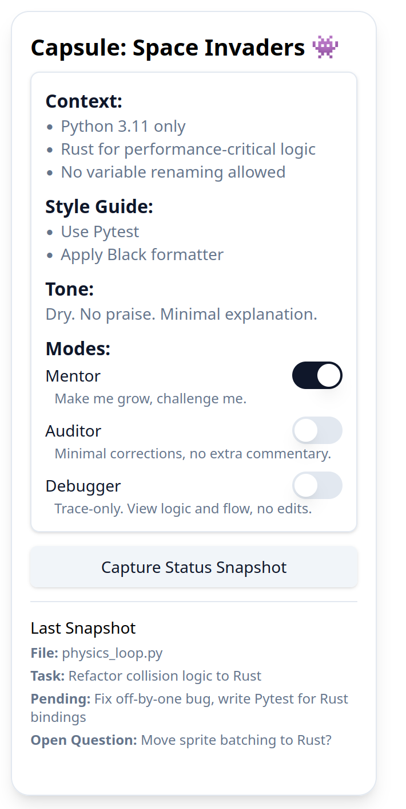
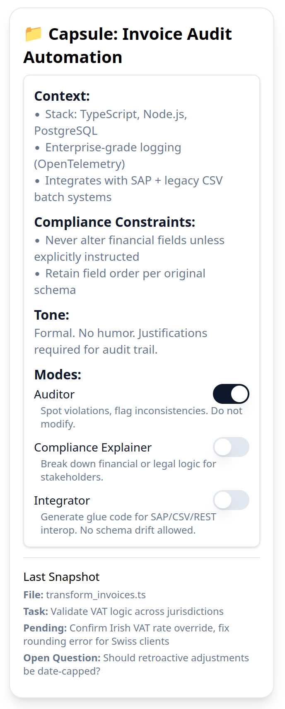

# Context Capsules: improving AI context and memory through user controls

[Read the whitepaper](./docs/whitepaper.md)

## What are Context Capsules:

A lightweight, human-facing **context management UI** that influences AI memory.
The idea is to provide humans with an easy, effortless way to steer AIs with strong, high-trust signals.
What it means for users: **No more wasted time in repetition. Set once, rest assured the AI follows.**

Context Capsules inform memory containers. They allow users to:

- Set **intent and use-case preferences** during onboarding ("I use this AI for therapy, summarizing complex reports, and daily writing")
- Select **which capsule** is active before starting a session ("Start with client X")
- Switch capsules mid-interaction ("Switch to Personal context")
- Create **custom domains** ("Coaching Clients", "Writing Drafts")
- Adjust **privacy and identity exposure** per capsule (e.g., pseudonym in one, real name in another)

Each capsule can contain summaries, snippets, structured metadata, or links to previous sessions.

Unlike purely automated memory systems, CCs follow a **mixed control model**. Default behavior remains seamless, but user-selected. Capsules override, redirect, or reinforce model memory when needed. This hybrid design increases accuracy, reduces friction, and gives users confidence to trust AI.

## MVP FOCUS
We are exploring an MVP focusing on developer use cases. We look to expand to the most frequent LLM use cases: text creation and editing, topic research, coaching, etc.

A capsule stores **stable, repetitive information** that helps developers steer AI:
- Stack + formatter/style (e.g., *Python 3.11, Black*, *TypeScript + ESLint rules*)
- Constraints (e.g., *never rename variables; don’t touch other files; retain schema field order*)
- Tone/verbosity (e.g., *no praise, minimal explanations*)
- **Mode** (behavior contract): **Code Agent** / **Auditor** / **QA**

To streamline workflows, context capsule MVP functionality explores:
- Repo binding (auto‑activate when inside project)
- Optional snapshot (last file/task note) for continuity
- Auto‑activate when a bound repo/folder opens.
- One‑keystroke toggle: `@auditor`, `@qa`, `@agent` within chat or command palette.
- Inline edit of constraints without leaving context.
- Manual injection path (pre‑automation): paste capsule prelude into each prompt.

## Contribute / Feedback
- Looking for devs that want to join us for quick MVP prototyping. Drop an email to: nestor-labs@nmb2b.slmail.me*
- Open an issue with your **most-repeated AI instruction** (the one you type 100+ times/month).
- PRs welcome for new capsule examples (keep them tight and opinionated).
